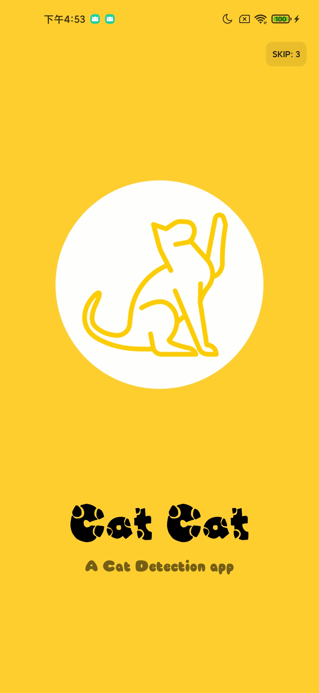
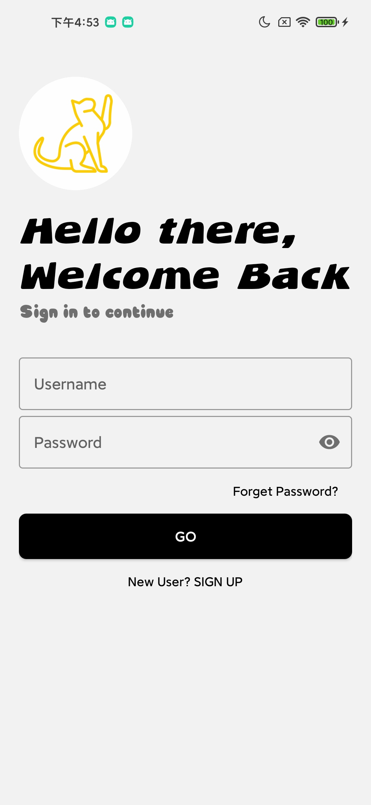
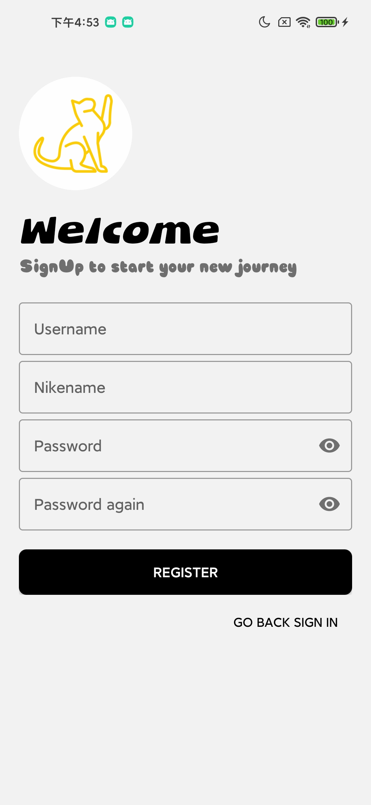
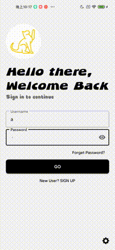
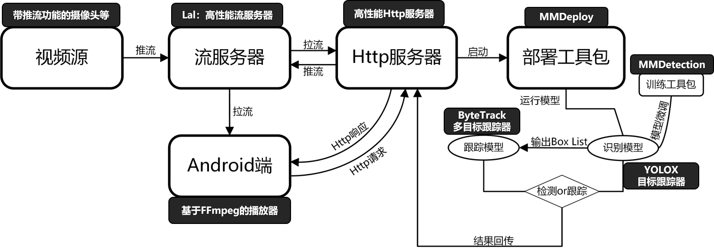

<div>&nbsp;</div>
<div align="center">
<a href="https://github.com/DDGRCF/GLCC_Server">
    <div>
        
    </div>
</a>
<div>&nbsp;</div>
    <div>
        
    </div>
</div>

<h1 align="center">

Cat Cat | MMDeply $\times$ GLCC 开源项目 | MMDeploy 实践

</h1>

<p align="center">
    <a href='https://github.com/DDGRCF/GLCC_Server'></a>  
    &nbsp;
    <a href='https://github.com/DDGRCF/GLCC_Server'></a>
    &nbsp;
    <a href='https://github.com/DDGRCF/GLCC_Server'></a>  
</p>

# 介绍

✨ 本项目是发起于[CCF GitLink开源编程夏令营](https://www.gitlink.org.cn/)(GitLink Code Camp, 简称GLCC). CCF GitLink 开源编程夏令营（GitLink Code Camp，简称 GLCC），是在 CCF 中国计算机学会指导下，由 GitLink 社区联合 CCF 开源发展委员会（CCF ODC）共同举办的面向全国高校学生的暑期开源项目实习计划。活动将联合各大开源企业、开源基金会、开源社区及开源领域专家，旨在鼓励高校学生通过参与真实的开源软件开发，感受开源文化，提升自身技术能力，进而达到为开源企业和社区输送优秀人才的目的。作为此次活动的特邀合作单位，OpenMMLab 设置了 12 个项目方向共 15 个课题

✨ 本项目基于[OpenMMLab](https://github.com/open-mmlab)下的子开源项目[MMDeploy](https://github.com/open-mmlab/mmdeploy)🔥🔥🔥实现的。MMDeploy 是 OpenMMLab 模型部署工具箱，为各算法库提供统一的部署体验。基于 MMDeploy，开发者可以轻松从训练 repo 生成指定硬件所需 SDK，省去大量适配时间。目前 MMDeploy 支持的算法 repo 有：mmcls、mmdet、mmdet3d、mmedit、mmocr、mmpose、mmseg、mmrazor。MMDeploy 同时支持超多推理后端：ONNX Runtime、TensorRT、ppl.nn、ncnn、OpenVINO，目前新版已经发布，快去体验一下吧🔥🔥🔥

✨ 针对如今猫猫饲养普及，但人们工作越来越忙碌，不能够照看猫猫的问题，本项目基于MMDeploy，实现了猫猫的检测识别、跟踪、视频记录、视频推送等服务，该服务主要具有以下两个功能:

* 能够对猫猫进行检测和跟踪，并将检测结果进行推流，可通过手机App播放
* 能够对猫猫进行划线检测，对于猫猫进入一定区域的时间点的视频进行记录并推送给用户

实际上通过简单的修改配置文件，能够很容易将本服务拓展到其他宠物的检测识别、跟踪服务，后面将会介绍如何修改配置文件

目前，该项目包括两个部分:

* **能够响应Http请求，完成检测跟踪的服务器** 👈 **目前位置**
* [能够发起Http请求，完成实现播放的客服端](https://github.com/DDGRCF/GLCC_AndroidApplication)

**✨服务器目前支持的功能:**

- [x] 响应基础的Http请求    
- [x] 猫猫检测和跟踪 
- [x] 猫猫的越线检测
- [x] 猫猫的越线时间点视频的记录
- [x] 猫猫监控的直播视频流的推送
- [x] 记录视频的文件视频流的推送
- [x] 提供配置文件可拓展其他类别
- [x] 猫猫记录视频的定时删除
- [ ] 加载SSL证书 
 
**✨客服端目前完成的功能:**

- [x] 发起基础的Http请求
- [x] 用户登录注册
- [x] 视频源注册删除
- [x] 猫猫监控的直播视频流的拉取
- [x] 猫猫记录的文件视频流的拉取
- [x] 支持服务器配置端口，IP等信息
- [ ] 加载SSL证书


# 预览

## 服务器


## 客服端
      


## 说明
|  <div align="center">✨**服务端**✨</div>           |  <div align="center">✨**客户端**✨</div>          |
| -------------------- | -------------------- | 
| 在上面的预览中，我们可以看到服务端运行后，(在客服端发送播放后)跳出来了一个视频界面，视频上两只猫猫被检测出来，并进行了跟踪。另外，我们可以注意到，外面有一个不规则的红色的框。这红色框就代表我们预先设置的栅栏，围栏之类的。猫猫进入了该区域就代表进入了危险区域，那么该红色框就变为实心，并发送通知给用户。这里为了方便演示，我直接将危险框放置在目标中心。值得一提的是，只有猫猫在该区域待够一定时间(可通过配置文件修改)，服务器才会将猫猫识别为进入该危险区域 |  在上面的预览中，我们可以看到在客服端登录后，客服端向服务器发送一个拉流请求并播放相关视频(视频播放界面的纵横比为4/3，如果拉取视频流的纵横比大于或小于这个尺寸，会使用灰色进行填充)，视频下有一个工具栏，工具栏上有**REGISTER**、**DELETE**、**DRAW**、**SOURCE**等字样，分别代表视频流的注册，视频流的删除，放置边界框(栅栏，围栏之类)，目前的播放源功能的按钮(可通过旁边的下拉栏可切换播放源)。然后工具栏下面，有一个可滑动的视频栏目，这个视频栏目就猫猫进入危险时所记录的视频，点击每一个视频栏目可实现视频的播放 dasfsadfasdfsadfsadf |


# 工作流程


# 安装与运行
### 环境依赖
* **MMDeploy**(OpenMMLab下部署工作包) ➡️ [点击进入](https://github.com/open-mmlab/mmdeploy.git)
* **Workflow**(基于C/C++致力于高性能服务器开发的库) ➡️ [点击进入](https://github.com/sogou/workflow/blob/master) 
* **Eigen**(C/C++的矩阵计算库) ➡️ [点击进入](https://eigen.tuxfamily.org/index.php?title=Main_Page)
* **FFmpeg**(包含视频、音频处理工具包和开发库) ➡️ [点击进入](https://ffmpeg.org/)
* **Mysql**(开放源码的数据库) ➡ [点击进入](https://www.mysql.com/)
* **JsonCpp**(基于C/C++的Json格式解析库) ➡ [点击进入](https://github.com/open-source-parsers/jsoncpp) 
* **Lal**(基于Go开发的高性能流服务器) ➡ [点击进入](https://github.com/q191201771/lal)
### 安装命令
上面的依赖都具有详细的安装文档，安装完所有依赖后，再进行下面的操作:

1. 设置相关变量
```bash
MMDeploy_DIR=/path/to/your/mmdeploy/install
e.g. MMDeploy_DIR=mmdeploy/build/install/cmake/MMDeploy

OpenCV_DIR=/path/to/your/opencv/install
e.g. OpenCV_DIR=/usr/local/opencv/lib/cmake/opencv4

DEigen3_DIR=/path/to/your/Eigen/install
e.g. DEigen3_DIR=/usr/local/eign/share/eigen3/cmake
```

2. 生成MakeFile
```bash
mkdir -p build && cd build && cmake .. -DMMDeploy_DIR=${MMDeploy_DIR} -DOpencv_DIR=${Opencv_DIR} -DEigen3_DIR=${Eigen3_DIR}
```
3. 编译
```bash
make -j$(nproc)
```
### 运行命令
运行之前请确保Lal流服务器以及Mysql数据服务器启动
```bash
cd build
config=/path/your/config # it just put in configs/configs.json
SPDLOG_LEVEL=error ./glcc_server ${config}
```

# 服务器配置
```json
{
    "Server": {
        "server_ip": "0.0.0.0",  // 服务器的IP地址  
        "server_port": 9999, // 服务器的Port
        "work_dir": "/path/your/work_dir", // 服务器的工作目录，用于储存用户资源
        "ssl_crt_path": "/path/your/server.crt", // ssl 证书路径
        "ssl_key_path": "/path/your/server_rsa_private.pem.unsecure" // ssl 私钥路径
    },
    "Log": {
        "log_dir": "/path/your/log", // log保存的目录
        "log_file_time_format": "%Y-%m-%d_%H:%M:%S", // log保存的格式
        "log_add_file_verbosity": "INFO", // 新的log保存的等级
        "log_all_file_verbosity": "INFO" // 所有log保存的等级
    },
    "Detector": {
        "mode": "TrackerDetector", // Detector的模式，默认为跟踪模式
        "ObjectDetector": { // 检测模型配置
            "model": "/path/to/your/model", // 模型所在位置
            "device": "cuda",  // 模型运行设备
            "device_id": 0, // 模型运行设备id
            "extra_config": { 
                "score_thre": 0.3, // 检测框的得分阈值
                "into_contour_time_gap_second": 5, // 宠物进预设框的阈值
                "out_contour_time_gap_second": 20, // 宠物出预设框的阈值
                "imshow_result_image": true, // 是否在播放时可视化结果(服务端)
                "class_names": ["cat"] // 检测的类别
            }
        },
        "TrackerDetector": { // 跟踪模型配置
            "model": "/path/your/model", // 模型所在位置
            "device": "cuda", // 模型运行设备
            "device_id": 0, // 模型运行设备id
            "extra_config": {
                "score_thre": 0.3, // 检测框的得分阈值
                "tracker_buffer": 30, // 跟踪的时所存储的最大帧数
                "into_contour_time_gap_second": 5, // 宠物进预设框的阈值
                "out_contour_time_gap_second": 20, // 宠物出预设框的阈值
                "imshow_result_image": true, // 是否在播放时可视化结果(服务端)
                "wh_ratio_thre_to_show": 1.6, // 可视化框的纵横比阈值(1.6>)
                "wh_multiply_thre_to_show": 20, // 可视化框的面积阈值(20<)
                "class_names": ["cat"] // 检测类别
            }
        }
    },
    "LiveGo": {
        "camera_push_port": 5544, // 推流视频源端口，推流本地摄像头: ffmpeg -re -framerate 25 -video_size 640x480 -i /dev/video0 -vcodec h264 -f rtsp rtsp://127.0.0.1:5544/live/test
        "dect_push_port": 1935, // 检测结果推送端口
        "state_check_port": 8083 // 流服务器状态查询端口
    },
    "DB": {
        "user_name": "root", // 数据库用户名
        "user_password": "9696", // 数据库密码
        "db_server_ip": "127.0.0.1", // 数据库的IP
        "db_server_port": 3306 // 数据库的端口
    },
    "Timer": {
        "interval_to_watch_detector_second": 60, // 间隔多少时间对直播视频流进行检查(检查是否过期)
        "interval_to_watch_file_second":5, // 间隔多少时间对文件视频进行检测(检查是否过期)
        "max_video_file_save_day": 2,  // 保存视频文件最大储存天数
        "max_detector_live_day": 365 // 直播视频流最大存在天数
    }
}

```

# 开源许可证
本项目采用 [MIT](./LICENSE) 开源许可证

# 感谢以下项目
* [MMDeploy](https://github.com/open-mmlab/mmdeploy.git)
* [MMDetection](https://github.com/open-mmlab/mmdetection)
* [YOLOX](https://github.com/Megvii-BaseDetection/YOLOX)
* [Workflow](https://github.com/sogou/workflow/blob/master)
* [MegFlow](https://github.com/MegEngine/MegFlow)
* [ByteTrack](https://github.com/ifzhang/ByteTrack)
* [loguru](https://github.com/emilk/loguru)
* [Eigen](https://gitlab.com/libeigen/eigen)
* [FFmpeg](https://github.com/FFmpeg/FFmpeg)
* [JsonCpp](https://github.com/open-source-parsers/jsoncpp)


# 技术交流
