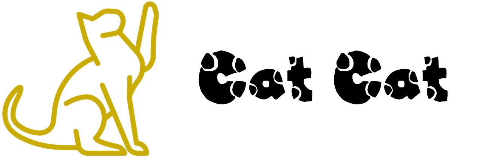

<div>&nbsp;</div>
<div align="center">

<div>

</div>
<div>&nbsp;</div>
<div>

</div>
</div>

# Cat Cat | MMDeply $\times$ GLCC 开源项目 | MMDeploy 实践

<p align="center">
    <a href='https://github.com/DDGRCF/GLCC_Server'></a>  
    <a href='https://github.com/DDGRCF/GLCC_Server'></a>
</p>

# 介绍

✨ 本项目是发起与[CCF GitLink开源编程夏令营(GitLink Code Camp, 简称GLCC)](https://www.gitlink.org.cn/). CCF GitLink 开源编程夏令营（GitLink Code Camp，简称 GLCC），是在 CCF 中国计算机学会指导下，由 GitLink 社区联合 CCF 开源发展委员会（CCF ODC）共同举办的面向全国高校学生的暑期开源项目实习计划。活动将联合各大开源企业、开源基金会、开源社区及开源领域专家，旨在鼓励高校学生通过参与真实的开源软件开发，感受开源文化，提升自身技术能力，进而达到为开源企业和社区输送优秀人才的目的。作为此次活动的特邀合作单位，OpenMMLab 设置了 12 个项目方向共 15 个课题

✨ 本项目基于[OpenMMLab](https://github.com/open-mmlab)下的子开源项目[MMDeploy](https://github.com/open-mmlab/mmdeploy)🔥🔥🔥实现的。MMDeploy 是 OpenMMLab 模型部署工具箱，为各算法库提供统一的部署体验。基于 MMDeploy，开发者可以轻松从训练 repo 生成指定硬件所需 SDK，省去大量适配时间。目前 MMDeploy 支持的算法 repo 有：mmcls、mmdet、mmdet3d、mmedit、mmocr、mmpose、mmseg、mmrazorMMDeploy 同时支持超多推理后端：ONNX Runtime、TensorRT、ppl.nn、ncnn、OpenVINO，目前新版已经发布，快去体验一下吧🔥🔥🔥

✨ 针对如今猫猫饲养普及，但人们工作越来越忙碌，不能够照看猫猫的问题，本项目基于MMDeploy，实现了猫猫的检测识别，跟踪的一款服务，改服务主要具有以下两个功能:
* 能够对猫猫进行检测和跟踪，并通过手机App进行播放
* 能够对能够对猫猫进行划线检测，也就对于猫猫进入一定区域的视频进行记录并推送给用户

目前，该项目包括两个部分:

* <u>**能够响应Http请求，完成检测跟踪的服务器**&emsp;⬅️️️ (目前位置)</u>
* [能够发起Http请求，完成实现播放的客服端](https://github.com/DDGRCF/GLCC_AndroidApplication)


# 预览

## 服务器


## 客服端
      

# 安装
### 环境依赖
* **MMDeploy** ➡️ [点击进入](https://github.com/open-mmlab/mmdeploy.git)
* **Workflow** ➡️ [点击进入](https://github.com/sogou/workflow/blob/master)
* **Eigen** ➡️ [点击进入](https://eigen.tuxfamily.org/index.php?title=Main_Page)
* **FFmpeg** ➡️ [点击进入](https://ffmpeg.org/)
### 安装命令
```bash
mkdir -p build && cd build && cmake ..
make -j8
```
# 开源许可证
本项目采用 [MIT](./LICENSE) 开源许可证

# 感谢以下项目
* [MMDeploy](https://github.com/open-mmlab/mmdeploy.git)
* [MMDetection](https://github.com/open-mmlab/mmdetection)
* [YOLOX](https://github.com/Megvii-BaseDetection/YOLOX)
* [Workflow](https://github.com/sogou/workflow/blob/master)
* [MegFlow](https://github.com/MegEngine/MegFlow)
* [ByteTrack](https://github.com/ifzhang/ByteTrack)
* [loguru](https://github.com/emilk/loguru)
* [Eigen](https://gitlab.com/libeigen/eigen)
* [FFmpeg](https://github.com/FFmpeg/FFmpeg)
